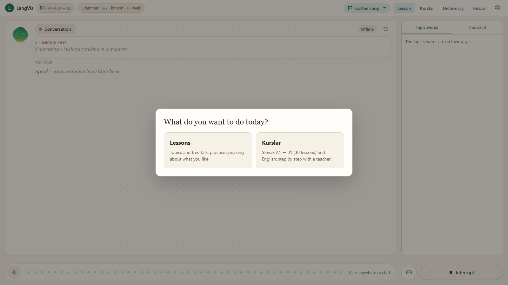

# LangVis

**A speaking language teacher in your browser.**
LangVis talks with you by voice, checks every sentence before it answers,
corrects you, shows you a richer way to say it and makes you say it again.
It teaches like a real teacher: first the words, then the grammar, then a
dialogue, and only then free conversation.


| | |
|---|---|
| **Languages** | English (A2 → B2) · Slovak (A1 → B1) |
| **Two ways to learn** | **Lessons** - topics and free talk · **Kurslar** - a fixed course from zero |
| **Slovak course** | 30 lessons in 6 weeks, A1 → B1, about 30 steps each |
| **Topics** | 13 ready topics + your own, each with its own dictionary and a taught first lesson |
| **Voice** | real-time two-way audio through the Gemini Live API |
| **Platform** | Python server + any modern browser · Windows, macOS, Linux |

---

## Contents

- [Quick start](#quick-start)
- [Two ways to learn](#two-ways-to-learn)
- [Lessons - topics and free talk](#lessons---topics-and-free-talk)
- [Kurslar - courses from zero](#kurslar---courses-from-zero)
- [How one sentence is checked](#how-one-sentence-is-checked)
- [Hearing a beginner](#hearing-a-beginner)
- [Dictionary and Hesab](#dictionary-and-hesab)
- [Languages and explanations](#languages-and-explanations)
- [What is saved](#what-is-saved)
- [Project structure](#project-structure)
- [Extending LangVis](#extending-langvis)
- [Limits and privacy](#limits-and-privacy)

---

## Quick start

```bash
python setup.py
```

```bash
python main.py
```

`setup.py` installs the dependencies. `main.py` starts LangVis and opens
http://localhost:8765 (`python main.py --no-open` starts only the server).

1. Paste a free [Gemini API key](https://aistudio.google.com/apikey) when the
   page asks for it.
2. Open **⚙ Settings**: the language to learn, your own language, the pace
   and how strictly to correct.
3. Choose **Lessons** or **Kurslar**, allow the microphone, and talk.

---

## Two ways to learn

Every time you open LangVis it asks what you want to do today.



| | **Lessons** | **Kurslar** |
|---|---|---|
| For | practising a language you already speak a little | starting a language from zero |
| What leads | the topic you pick | the course material, lesson by lesson |
| Order | free: any grammar, any time | fixed: every lesson builds on the last |
| Left of the board | - | the course syllabus, always open |
| Right of the board | the topic's words | this lesson's words and words to review |

You can switch at any time: the **Kurslar** tab in the header, or the
**Lessons / Kurslar** switch on the Kurslar page.

---

## Lessons - topics and free talk

Pick a topic in the header: Daily life, Work, Home, Food, Shopping and money,
Travel, Health, Free time, Family and friends, Technology, City and transport,
Education, Opinions and society - or **your own** (a coffee shop, football,
a job interview...). Free talk has no topic at all.

### The first lesson in a topic

A new topic does not start with a question you cannot answer yet. The teacher
first gives you the material, step by step, and you repeat each part:

1. **Words and word partners** - taken from the topic's own dictionary
2. **Linking words** - and, but, then, because
3. **Grammar** - the rule of your current unit, shown on this topic
4. **Longer sentences** - how one short sentence grows: + where, + why
5. **A dialogue** - line by line, the teacher plays the other person
6. **Your own sentences** - you finish sentence frames about your life


Only then does the conversation start. The teacher's job there is to keep you
talking: open questions, "why?", "tell me more", and "make it longer with a
linking word".

### Corrections

A sentence with a mistake is corrected **before** the teacher answers it. The
mistakes are red and numbered, each with its grammar and a one-line reason,
and the teacher walks to the word it explains. You say the right sentence,
and only then does the conversation go on.


### Say it better

A correct sentence is lifted one level up: a stronger word, a collocation or
a phrasal verb, each explained and translated. You say the better version too.


### Grammar on the board

Ask "explain the present perfect", or click a mistake, and the rule is drawn
on the board: the rule in one sentence, the form, a picture (a timeline, two
columns, blocks), your own mistake and examples. Then three practice questions.


### The English course inside every topic

| Stage | Title | Units |
|---|---|---|
| **A2.1** | Everyday forms | Present simple & questions · Present continuous · Past simple · Articles, prepositions & word order |
| **A2.2** | Talking beyond now | Future: going to & will · Comparatives & quantity · Modals · Linking a story |
| **B1.1** | Perfect and past | Present perfect · Past continuous & used to · Perfect vs past simple · First conditional |
| **B1.2** | Longer sentences | Second conditional · -ing or to · Relative clauses & word forms · Passive voice |
| **B2.1** | Precision in the past | Past perfect · Third conditional & wishes · Reported speech · Modals of deduction |
| **B2.2** | Range and control | Advanced passive · Future continuous & perfect · Discourse markers · Collocations |

Every topic climbs the whole course on its own; the questions grow up with the
grammar. Grammar belongs to you, not to a topic, so later topics climb faster.

---

## Kurslar - courses from zero

A course is fixed material written for someone who knows **nothing** of the
language. The teacher follows it exactly, never skips and never jumps ahead,
and remembers the exact step where you stopped.


The page shows the languages (Slovak is ready, English is coming), the lesson
to do now with its words and progress, and the whole course by week. Lessons
you have finished can be opened again.

### One course lesson

Every lesson has about 30 steps. The syllabus on the left shows where you are;
the right side lists the lesson's words with their meaning and Azerbaijani
translation, and the word being taught right now is framed.

| Part | What happens |
|---|---|
| **Review** | the teacher says a word from an earlier lesson in English, you say it in Slovak |
| **Words** | 8 new words, each said, explained and repeated |
| **Phrases** | 5 ready phrases to say |
| **Grammar** | one rule in simple words, a table on the board, 3 examples to repeat |
| **Dialogue** | the teacher plays a role, you say your own lines |
| **Translate** | the teacher says an English sentence, you say it in Slovak yourself |
| **Questions for you** | questions about your own life, with a model answer |
| **Speaking task** | free conversation on the lesson; say "next lesson" to go on |

Grammar in a course lesson:


The dialogue, line by line:


Translation practice:


### The Slovak course: A1 → B1 in 6 weeks

| Week | Level | Lessons |
|---|---|---|
| **1** · Me and my world | A1 | Hello and my name · Where are you from (byť) · Numbers and age (mať) · My family (môj, moja) · Job and languages |
| **2** · Every day | A1 | My day and the time · In the café · Shopping and prices · In the city · Free time and likes |
| **3** · Past and future | A2 | Yesterday (past tense) · My weekend story · Plans (future) · My flat · At the doctor |
| **4** · Out in the world | A2 | Travel and transport · My opinion · Comparing · Phone calls and requests · A2 checkpoint |
| **5** · Experiences, wishes, people | B1 | Experiences (aspect) · Wishes with keby · Giving advice · Describing people (ktorý) · Job interview |
| **6** · Real life in Slovakia | B1 | A complaint · News and events · At the office (residence permit) · Holidays and traditions · Final B1 test |

In weeks 1-2 everything is explained in simple English; from week 3 in simple
Slovak. The board always shows the Azerbaijani translation too.

---

## How one sentence is checked

LangVis **thinks before it answers**. A live voice model normally replies the
instant you stop talking. Here the server decides when your turn ends, holds
the tutor's reply, transcribes your own voice (mistakes kept) and checks it.
Only then does the tutor speak, told exactly what to say.

```
you speak ──▶ thinking ──▶ a mistake?  "Did you mean: …? Say it."     ──▶ you repeat ✓
                                                                             │
                           correct?    "Better: … Now you say it."  ◀────────┘
                                                                     ──▶ you repeat ✓
                           "Good." + an answer + the next question
```

- A repeat is checked by the system, not by the model: it must match the
  sentence and contain the part that matters.
- A repeat is asked for at most twice, then the lesson moves on. **Skip**
  moves on at once.
- **I didn't say that** takes back a sentence that was misheard.
- **Fluency · 2 min** lets you talk without being stopped; the feedback comes
  at the end.
- Typed sentences go through exactly the same steps.

---

## Hearing a beginner

Beginner speech is slow and has an accent, so LangVis helps the listening side:

- **It waits longer for the end of your sentence.** The pause that ends a
  sentence follows your level: 1.9 s at A1, 1.6 s at A2, 1.3 s at B1, 1.1 s
  above - so a pause to find the next word does not cut you off.
- **The transcriber is told what to expect**: the sentence you were just asked
  to say and the lesson's words, and that you are a beginner with an accent.
  It still writes what you really said. Languages other than English use the
  stronger model.
- **Repeating is not an echo.** The tutor's own voice coming back through the
  speakers is dropped only when it starts during its speech or right after it.
  You repeating "Say it: prosím" a moment later is you.
- A sentence that takes too long to check changes nothing in the lesson; the
  lesson never moves on without the tutor knowing.

---

## Dictionary and Hesab

### Dictionary

Every item you meet - the topic lists and every upgrade the board showed you -
is kept for good, with how often and on how many **different days** you used it.


| Status | Means | Comes back |
|---|---|---|
| new | not used yet | in its topic, until you use it |
| learning | used on 1-2 different days | after 1, then 3 days |
| learned | used on 3+ different days | after 7 or 14 days |
| strong | used on 5+ different days | every 30 days, forever |

### Hesab - your account

Your level over time, dictionary growth, mistakes per day and where the
mistakes are, the grammar syllabus with your mastery of every rule, how far
every topic has come, and every correction ever made.


---

## Languages and explanations

| Language | Starts at | Explained in |
|---|---|---|
| English | A2 | simple English |
| Slovak | A1 | simple English at A1, simple Slovak from A2 |

Your own language (Azerbaijani, Turkish or Russian) is used for translations
on the board and in the dictionary. Progress is kept separately per language.

---

## What is saved

Everything stays on your computer, per language (`english/`, `slovak/`):

| File | What it holds |
|---|---|
| `level.json` | level, skills, mistakes, course position, dictionary - the source of truth |
| `progress.md` | a readable summary, regenerated from `level.json` |
| `intensive.json` | the course: current lesson, current step, finished lessons |
| `topics/*.json` | each topic's fixed word list and its first lesson |
| `history/*.jsonl` | the conversation of every topic, and of the course |

---

## Project structure

```
main.py                     starts the server and opens the browser
setup.py                    installs dependencies

web/
  server.py                 aiohttp server: page, WebSocket, JSON for the pages
  bridge.py                 the session's messages to every open tab
  static/                   the page (no build step)
    index.html · app.css
    app.js                  socket, header, pages, chooser, settings
    board.js                the board and the tutor's walk across it
    pages.js                Kurslar, Dictionary and Hesab pages, the course syllabus
    tutor.js · diagrams.js  the LangVis face and the grammar pictures
    audio.js · mic-worklet.js

core/
  live.py                   the Gemini Live session: turns, thinking, voice, echo
  prompt.txt                the teacher's core instructions
  plugin_loader.py · selflog.py

tutor/
  curriculum.py             English skills, rules, stages; the languages
  slovak.py                 Slovak skills, rules and stages
  intensive_slovak.py       the Slovak course: 30 lessons, A1 → B1
  topics.py                 topics, their dictionaries and first lessons
  progress.py               learner state: level, skills, course, dictionary
  analysis.py               transcription and per-sentence analysis

plugins/
  language_tutor.py         the teacher: taught steps, courses, correct → enrich → record

docs/screenshots/           the pictures in this file
memory/ · config/           settings, memory and your local API key
```

---

## Extending LangVis

### A new course

Write a file like `tutor/intensive_slovak.py`: a list of lessons, each with
words, phrases, one grammar point, a dialogue, translations, questions and a
speaking task. Register it in `INTENSIVE_COURSES` in
`plugins/language_tutor.py` and it appears on the Kurslar page.

### Plugins

Any file in `plugins/` with a `PLUGIN` dict and a `run()` function becomes a
tool the tutor can call. Start from `plugins/_template.py`.

| Hook | Use |
|---|---|
| `observe(text, player)` | see every sentence |
| `format_for_prompt()` | standing instructions for every session |
| `opening_note()` | the first thing the tutor says in a lesson |
| `gate_audio()` / `gate_text()` | decide the tutor's reply before it speaks |
| `status_for_ui()` / `coaching_for_ui()` | what the page shows |
| `PLUGIN_SETTINGS` | fields in the ⚙ settings form |

---

## Limits and privacy

- A **free Gemini key** has daily limits. When a model is busy or its limit is
  used up, the next model takes over; when all are spent, the board says why
  the tutor is quiet.
- The server listens on `127.0.0.1` only, and only its own page may connect.
- Your API key, settings, memory and all progress files stay on your computer
  and are git-ignored. Audio is sent only to the Gemini API during a lesson.

---

## Author

**Taleh Rzayev** - design, code and curriculum.
