<p align="center">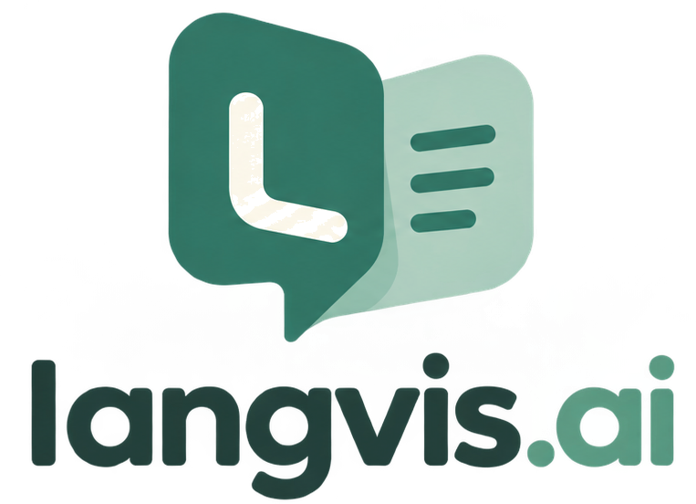</p>

**A speaking language teacher in your browser.**
LangVis talks with you by voice and checks every sentence before it answers.
It has two sides: **Courses**, where a teacher takes you through fixed course
material step by step, and the **Tutor**, where you talk freely about anything
and ask about any grammar or word.

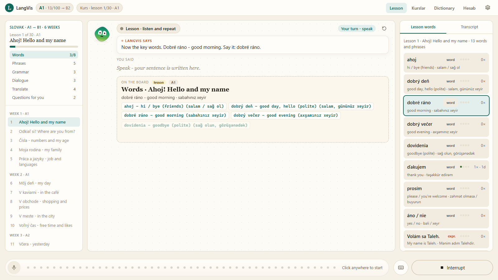

| | |
|---|---|
| **Languages** | English · Slovak - switched in the header, each with its own level and progress |
| **Courses** | Slovak A1 → B1 (30 lessons, 6 weeks) · English A2 → B1+ phrasal verbs for daily speaking (20 lessons, 5 weeks) |
| **Tutor** | free conversation: 13 topics + your own, or free talk; grammar on the board whenever you ask |
| **Voice** | real-time two-way audio through the Gemini Live API |
| **Platform** | Python server + any modern browser · Windows, macOS, Linux |

---

## Contents

- [Quick start](#quick-start)
- [Courses and Tutor](#courses-and-tutor)
- [Tutor - free conversation](#tutor---free-conversation)
- [Courses - learning from zero](#courses---learning-from-zero)
- [How one sentence is checked](#how-one-sentence-is-checked)
- [Hearing a beginner](#hearing-a-beginner)
- [Account, Dictionary and Grammar](#account-dictionary-and-grammar)
- [Languages and explanations](#languages-and-explanations)
- [What is saved](#what-is-saved)
- [Project structure](#project-structure)
- [Extending LangVis](#extending-langvis)
- [Limits and privacy](#limits-and-privacy)

---

## Quick start

```bash
docker compose up -d
```

```bash
python setup.py
```

```bash
python main.py
```

`docker compose up -d` starts the accounts database (PostgreSQL, port 5433,
only reachable from this computer). The defaults work as they are; copy
`.env.example` to `.env` to change them.

`setup.py` installs the dependencies. `main.py` starts LangVis and opens
http://localhost:8765 on the **Home** page (`python main.py --no-open`
starts only the server).

1. **Sign up** (top right) with your name, email and a password, and choose
   the language to learn. Every account has its own level, course, words,
   history, memory and settings; the tutor calls you by your name.
2. Paste a free [Gemini API key](https://aistudio.google.com/apikey) when the
   page asks for it.
3. Open **Settings** from your name at the top right: your own language, the pace and how strictly to correct.
4. On **Home**, press **Start learning a new language** and choose English or
   Slovak - its courses open. Continue your course, or open the **Tutor**, pick
   a topic and press **Start**. Allow the microphone, and talk.

---

## Courses and Tutor

The header holds everything: the logo, the **language** you learn (🌐) and your
level, and the pages - **Home**, **Courses**, **Tutor** and **Account**. The
**topic** and the **grammar syllabus** appear only on the Tutor page.

**Home** is the start page: what LangVis is, the two ways to learn, every
course as tabs (Slovak | English) with its weeks and lessons, and **Start
learning a new language** - it asks which language, then opens its courses.

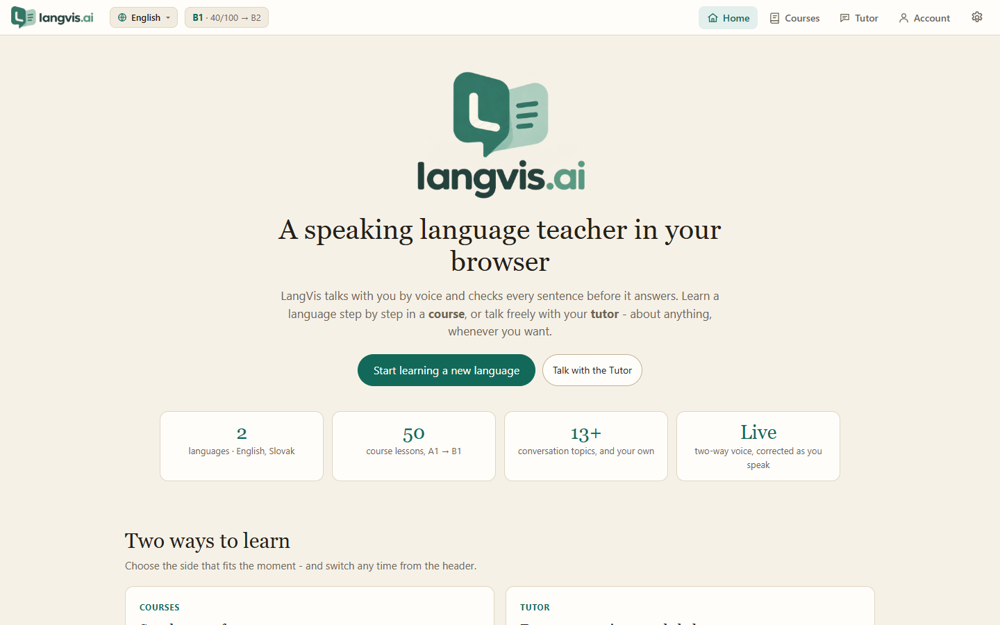

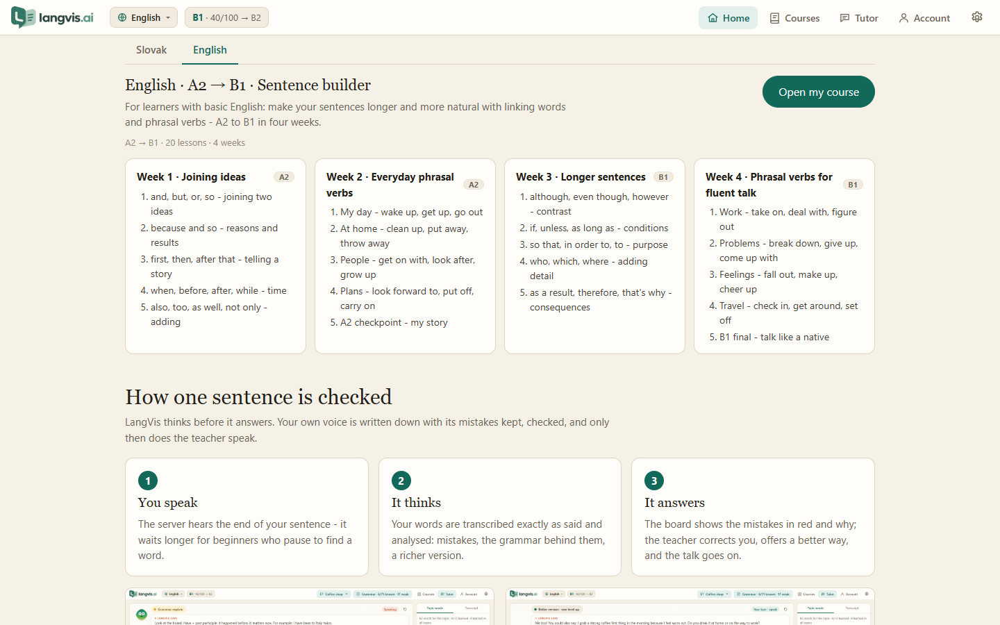


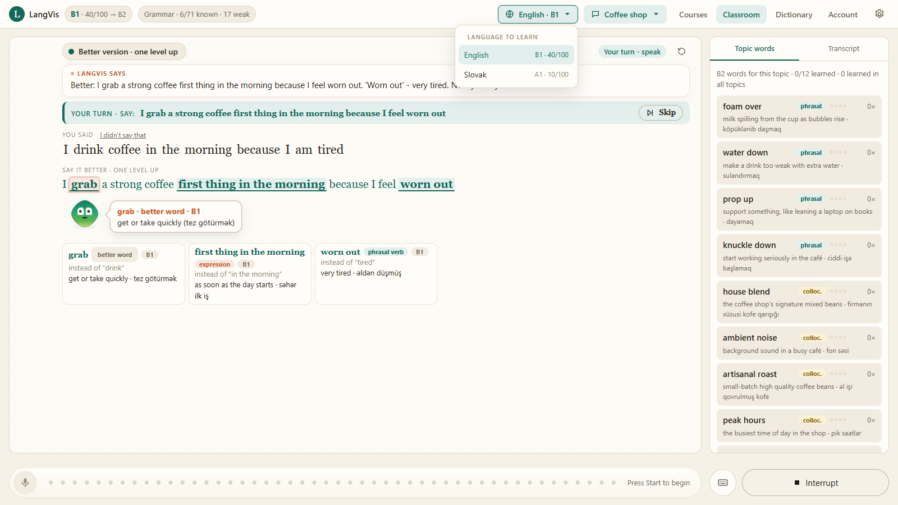

| | **Courses** | **Tutor** |
|---|---|---|
| For | learning step by step, from zero | practising freely |
| What leads | the course material, lesson by lesson | you - any topic, any question |
| Rules | strict: every step is taught and repeated | none: gentle guidance, no forced repeats |
| Left of the board | the course syllabus, always open | - |
| Right of the board | this lesson's words and words to review | the topic's words |

**Nothing starts by itself.** The board waits with a **Start** button and the
teacher begins only when you press it. **Continue the lesson** on the Courses
page is a Start too. Leaving the page, choosing another topic, language or
course lesson, or losing the connection stops the lesson until you press
**Start** again.

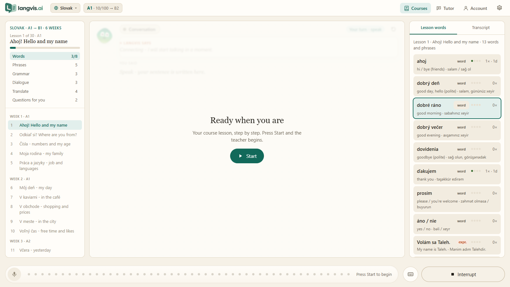

The **language select** in the header (🌐 `English`, `Slovak`)
switches the language you are learning. The page reloads and everything - the
level, the courses, the words, the history - is that language's.

---

## Tutor - free conversation

The Tutor is a friendly conversation partner, not a drill. Talk about anything,
pick a topic in the header (Daily life, Work, Home, Food, Shopping and money,
Travel, Health, Free time, Family and friends, Technology, City and transport,
Education, Opinions and society, or **your own** - a coffee shop, football,
a job interview...), or stay in free talk. Ask for a grammar rule, a word, a
role play or a quick exercise at any moment.

The Tutor helps with **guidance, not rules**:

- A mistake is corrected **once**, kindly ("We'd say: ..."), and the talk goes
  on - you do not have to repeat it. The board shows the mistakes in red, the
  corrected sentence and why.
- Now and then it offers **one more natural way** to say it ("You could also
  say: ..."), shown on the board with each new word explained and translated.
- It keeps you speaking: an answer, then a follow-up question about what you said.

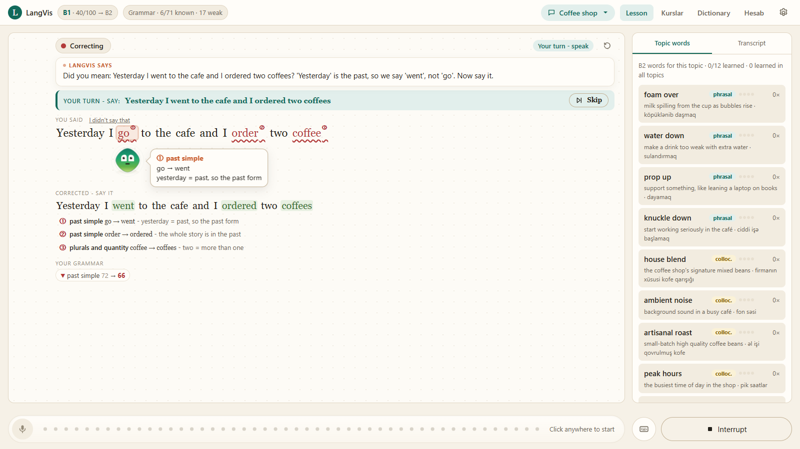

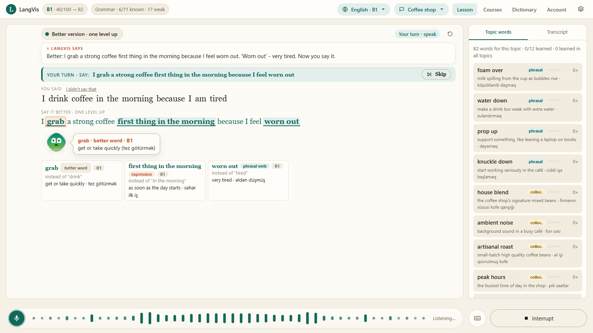

### Grammar on the board

Ask "explain the present perfect", or click a mistake, and the rule is drawn
on the board: the rule in one sentence, the form, a picture (a timeline, two
columns, blocks), your own mistake and examples. Then three practice questions.

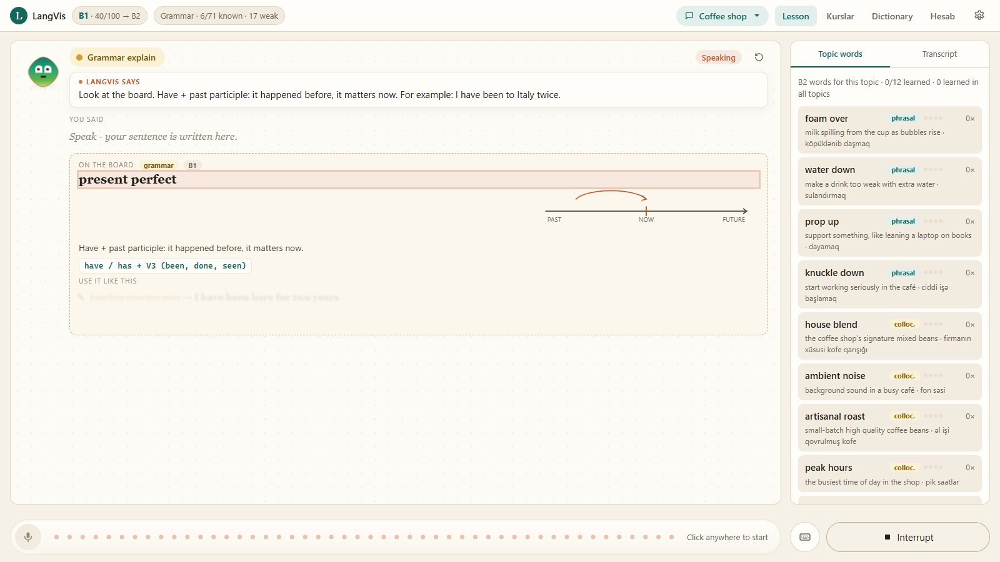

### A topic taught step by step - when you ask

Say "teach me this topic" and the Tutor gives the topic's material step by
step: its words and word partners, linking words, a grammar point, how to make
a sentence longer, a model dialogue and sentence frames.

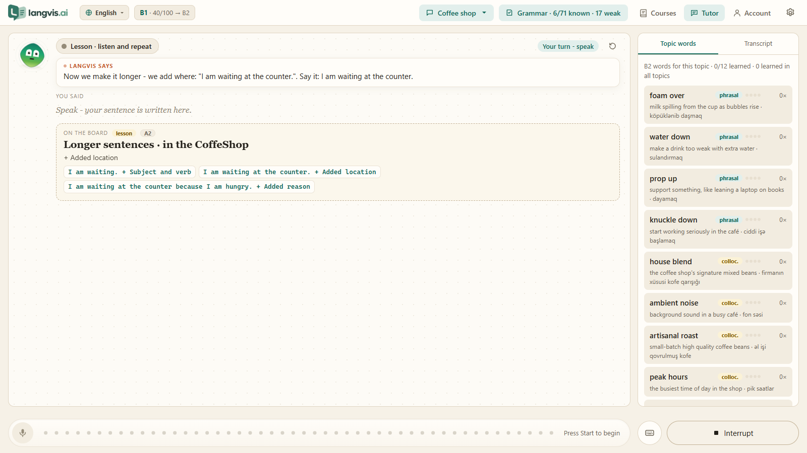

### The English grammar ladder behind the Tutor

| Stage | Title | Units |
|---|---|---|
| **A2.1** | Everyday forms | Present simple & questions · Present continuous · Past simple · Articles, prepositions & word order |
| **A2.2** | Talking beyond now | Future: going to & will · Comparatives & quantity · Modals · Linking a story |
| **B1.1** | Perfect and past | Present perfect · Past continuous & used to · Perfect vs past simple · First conditional |
| **B1.2** | Longer sentences | Second conditional · -ing or to · Relative clauses & word forms · Passive voice |
| **B2.1** | Precision in the past | Past perfect · Third conditional & wishes · Reported speech · Modals of deduction |
| **B2.2** | Range and control | Advanced passive · Future continuous & perfect · Discourse markers · Collocations |

Your level and grammar are measured from everything you say, and the Tutor
speaks at your level with words one step above it.

---

## Courses - learning from zero

A course is fixed, hand-written material. The teacher follows it exactly,
never skips and never jumps ahead, and remembers the exact step where you
stopped. The Courses page shows only the courses of the language chosen in the
header: Slovak shows the Slovak course, English the English one.

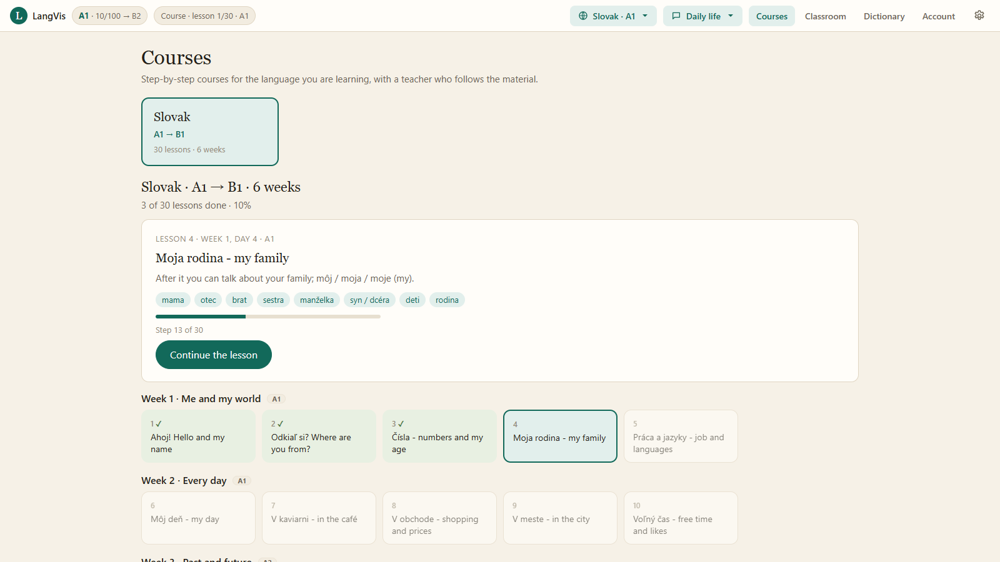

The page shows the course, the lesson to do now with its words and progress,
and the whole course by week. Lessons you have finished can be opened again.

### One course lesson

Every lesson has about 30 steps. The syllabus on the left shows where you are;
the right side lists the lesson's words with their meaning and Azerbaijani
translation, and the word being taught right now is framed.

| Part | What happens |
|---|---|
| **Review** | the teacher says a word from an earlier lesson in English, you say it in Slovak |
| **Words** | 8 new words, each said, explained and repeated |
| **Phrases** | 5 ready phrases to say |
| **Grammar** | one rule in simple words, a table on the board, 3 examples to repeat |
| **Dialogue** | the teacher plays a role, you say your own lines |
| **Translate** / **Build sentences** | Slovak: say an English sentence in Slovak · English: join or upgrade sentences yourself |
| **Questions for you** | questions about your own life, with a model answer |
| **Speaking task** | free conversation on the lesson; say "next lesson" to go on |

Grammar in a course lesson:

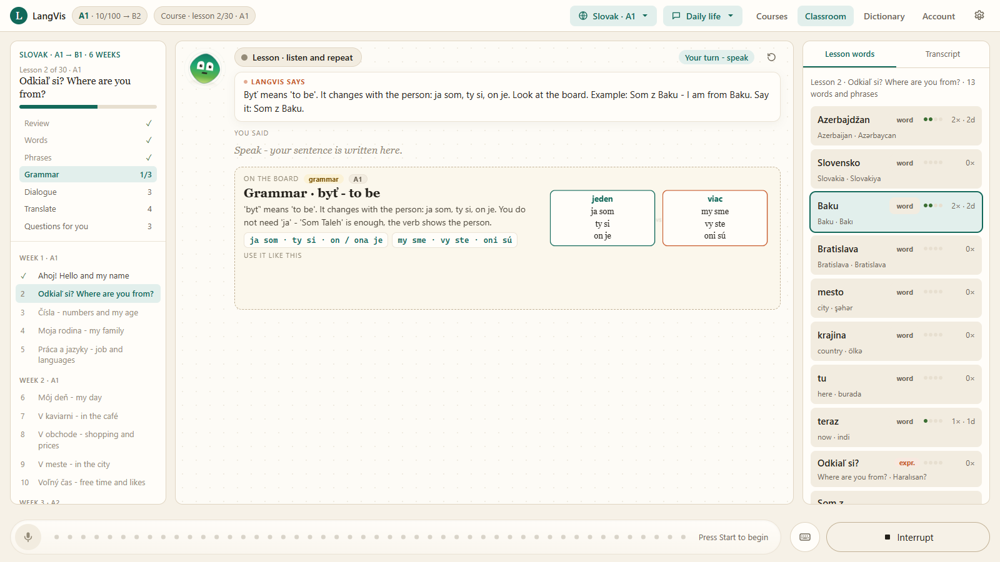

The dialogue, line by line:

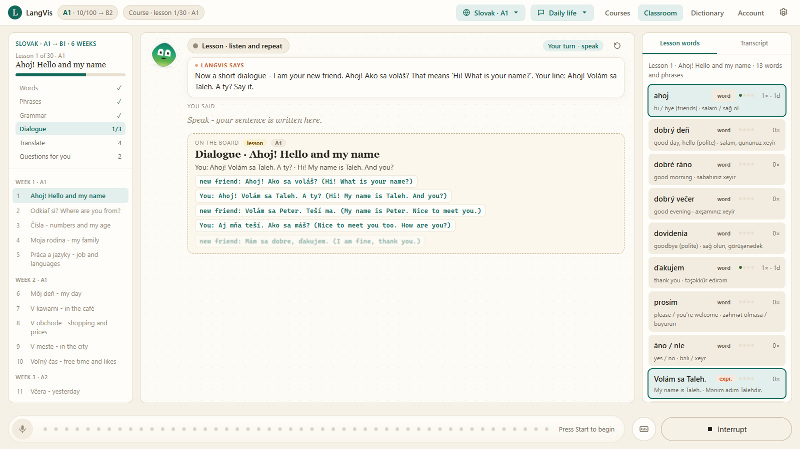

Translation practice:

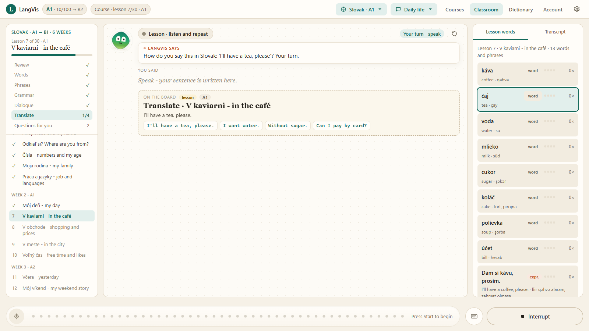

### The Slovak course: A1 → B1 in 6 weeks

| Week | Level | Lessons |
|---|---|---|
| **1** · Me and my world | A1 | Hello and my name · Where are you from (byť) · Numbers and age (mať) · My family (môj, moja) · Job and languages |
| **2** · Every day | A1 | My day and the time · In the café · Shopping and prices · In the city · Free time and likes |
| **3** · Past and future | A2 | Yesterday (past tense) · My weekend story · Plans (future) · My flat · At the doctor |
| **4** · Out in the world | A2 | Travel and transport · My opinion · Comparing · Phone calls and requests · A2 checkpoint |
| **5** · Experiences, wishes, people | B1 | Experiences (aspect) · Wishes with keby · Giving advice · Describing people (ktorý) · Job interview |
| **6** · Real life in Slovakia | B1 | A complaint · News and events · At the office (residence permit) · Holidays and traditions · Final B1 test |

In weeks 1-2 everything is explained in simple English; from week 3 in simple
Slovak. The board always shows the Azerbaijani translation too.

### The English course: phrasal verbs for daily speaking, A2 → B1+ in 5 weeks

For a learner who already speaks basic English and wants to talk about daily
life. Every lesson teaches six everyday **phrasal verbs** and shows how to make
a sentence **grow**: "I wake up." → "I wake up at seven." → "I usually wake up
at seven on weekdays, but I get up at nine on Sundays." The learner first sees
one sentence grow part by part (when, where, who with, why, a contrast, a
result), then **builds** sentences themselves.

| Week | Level | Lessons |
|---|---|---|
| **1** · My day with phrasal verbs | A2 | Morning (wake up, get up) · Going out (set off, get on) · Evening (come back, tidy up) · Free time (hang out, eat out, stay in) |
| **2** · People, messages and plans | A2 | Phone (call back, pick up) · Friends (meet up, catch up) · Shopping (look for, try on) · Plans (look forward to, put off) |
| **3** · Problems, work and stories | B1 | Problems (break down, run out of) · Work (take on, deal with) · Stories (end up, turn out) · Plans change (work out, back out) |
| **4** · Feelings, habits and advice | B1 | Feelings (cheer up, calm down) · People (fall out, make up) · Habits (give up, cut down on) · Advice (think over, go for) |
| **5** · Fluent daily speaking | B1+ | Travel (check in, get around) · Discussion (come up with, bring up) · Changes (move on, carry on) · B1+ final story |

Everything is explained in simple English, with the Azerbaijani translation of
every word and phrase on the board.

---

## How one sentence is checked

LangVis **thinks before it answers**. A live voice model normally replies the
instant you stop talking. Here the server decides when your turn ends, holds
the tutor's reply, transcribes your own voice (mistakes kept) and checks it.
Only then does the tutor speak, told exactly what to say.

```
you speak ──▶ thinking ──▶ a mistake?  "Did you mean: …? Say it."     ──▶ you repeat ✓
                                                                             │
                           correct?    "Better: … Now you say it."  ◀────────┘
                                                                     ──▶ you repeat ✓
                           "Good." + an answer + the next question
```

- In a **course** a mistake and a better version are repeated; in the **Tutor**
  they are only said once and the talk goes on.
- A repeat is checked by the system, not by the model: it must match the
  sentence and contain the part that matters.
- A repeat is asked for at most twice, then the lesson moves on. **Skip**
  moves on at once.
- **I didn't say that** takes back a sentence that was misheard.
- **Fluency · 2 min** lets you talk without being stopped; the feedback comes
  at the end.
- Typed sentences go through exactly the same steps.

---

## Hearing a beginner

Beginner speech is slow and has an accent, so LangVis helps the listening side:

- **It waits longer for the end of your sentence.** The pause that ends a
  sentence follows your level: 1.9 s at A1, 1.6 s at A2, 1.3 s at B1, 1.1 s
  above - so a pause to find the next word does not cut you off.
- **The transcriber is told what to expect**: the sentence you were just asked
  to say and the lesson's words, and that you are a beginner with an accent.
  It still writes what you really said. Languages other than English use the
  stronger model.
- **Repeating is not an echo.** The tutor's own voice coming back through the
  speakers is dropped only when it starts during its speech or right after it.
  You repeating "Say it: prosím" a moment later is you.
- A sentence that takes too long to check changes nothing in the lesson; the
  lesson never moves on without the tutor knowing.

---

## Account, Dictionary and Grammar

**Account** shows your level over time, dictionary growth, mistakes per day,
where the mistakes are and every correction ever made. Two buttons at the top
right open its other pages: **Dictionary** and **Grammar**.

### Dictionary

Every item you meet - the topic lists and every upgrade the board showed you -
is kept for good, with how often and on how many **different days** you used it.

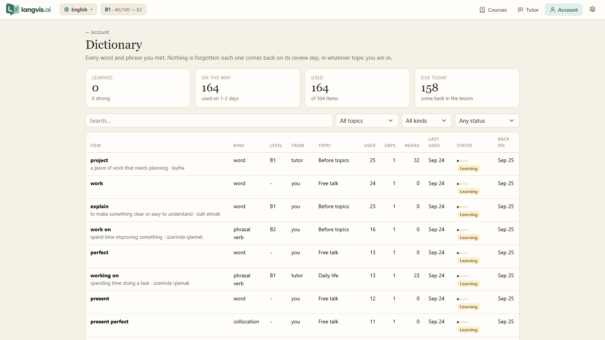

| Status | Means | Comes back |
|---|---|---|
| new | not used yet | in its topic, until you use it |
| learning | used on 1-2 different days | after 1, then 3 days |
| learned | used on 3+ different days | after 7 or 14 days |
| strong | used on 5+ different days | every 30 days, forever |

### Grammar

Every grammar rule from A1 to B2 with how well you know it, measured from what
you say. Click a rule to see its explanation and your own mistakes.

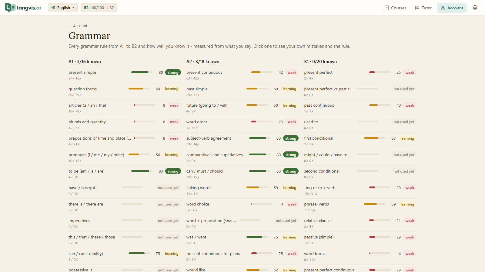

### Account

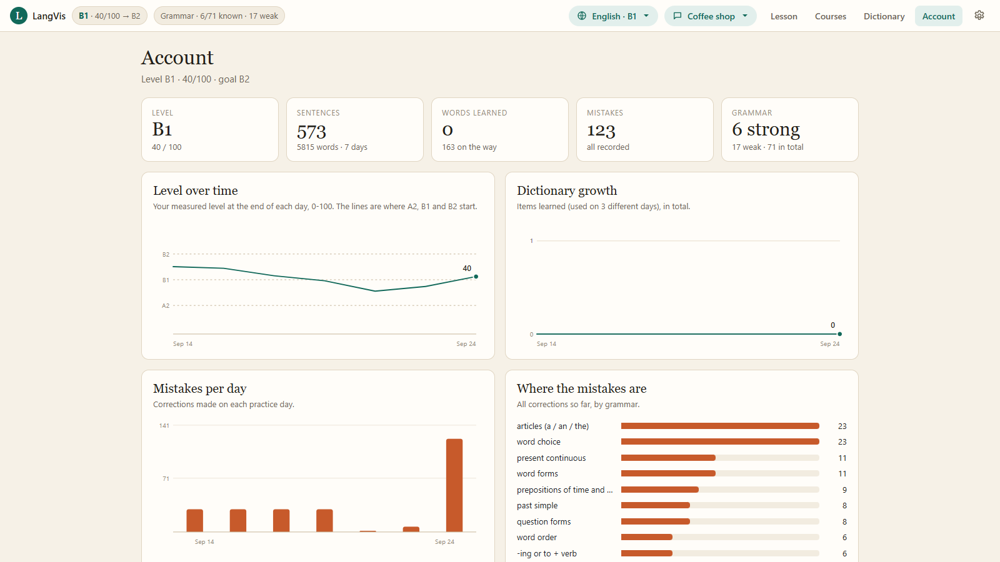

---

## Languages and explanations

| Language | Starts at | Explained in |
|---|---|---|
| English | A2 | simple English |
| Slovak | A1 | simple English at A1, simple Slovak from A2 |

Your own language (Azerbaijani, Turkish or Russian) is used for translations
on the board and in the dictionary. Progress is kept separately per language.

---

## What is saved

Everything is kept in the PostgreSQL database of `docker-compose.yml` - there
are no data files. The accounts (name, email, a scrypt hash of the password,
sessions) and everything an account learns are rows of their own:

| Table | What it holds |
|---|---|
| `users` · `sessions` | the accounts and their signed-in browsers |
| `app_settings` | the Gemini keys, shared by all accounts on this computer |
| `user_settings` | the account's name, voice and tutor settings |
| `user_memory` | what LangVis remembers about the learner |
| `learner_progress` | per language: level, skills, mistakes, dictionary - the source of truth |
| `learner_reports` | per language: a readable summary, regenerated from the progress |
| `course_progress` | per language: current lesson, current step, finished lessons |
| `topic_materials` | each topic's fixed word list and its first lesson |
| `conversation_lines` | every line of every topic's conversation, and of the course |

There is one microphone and one voice lesson, so one account uses LangVis at a
time: when another account signs in, the first one's lesson stops (its
progress is kept) and its tabs say so.

Earlier versions kept JSON files (`users/u<id>/`, `english/`, `slovak/`,
`memory/long_term.json`, `config/api_keys.json`). On start they are moved into
the database once and deleted; the very first account takes over the progress
made before accounts existed.

---|---|
| `level.json` | level, skills, mistakes, course position, dictionary - the source of truth |
| `progress.md` | a readable summary, regenerated from `level.json` |
| `intensive.json` | the course: current lesson, current step, finished lessons |
| `topics/*.json` | each topic's fixed word list and its first lesson |
| `history/*.jsonl` | the conversation of every topic, and of the course |

---

## Project structure

```
main.py                     starts the server and opens the browser
setup.py                    installs dependencies

web/
  server.py                 aiohttp server: page, WebSocket, JSON for the pages
  bridge.py                 the session's messages to every open tab
  static/                   the page (no build step)
    index.html · app.css
    app.js                  socket, header, pages, the language choice, settings
    img/                    the logo and the pictures on the Home page
    board.js                the board and the tutor's walk across it
    pages.js                Home, Courses, Account, Dictionary and Grammar pages, the course syllabus
    tutor.js · diagrams.js  the LangVis face and the grammar pictures
    audio.js · mic-worklet.js

core/
  live.py                   the Gemini Live session: turns, thinking, voice, echo
  prompt.txt                the teacher's core instructions
  store.py                  every piece of data, in PostgreSQL
  plugin_loader.py · selflog.py

tutor/
  curriculum.py             English skills, rules, stages; the languages
  slovak.py                 Slovak skills, rules and stages
  intensive_slovak.py       the Slovak course: 30 lessons, A1 → B1
  intensive_english.py      the English course: phrasal verbs for daily speaking, 20 lessons, A2 → B1+
  topics.py                 topics, their dictionaries and first lessons
  progress.py               learner state: level, skills, course, dictionary
  analysis.py               transcription and per-sentence analysis

plugins/
  language_tutor.py         the teacher: taught steps, courses, correct → enrich → record

docs/                       logo.png and screenshots/ - the pictures in this file
memory/                     settings and memory (stored through core/store.py)
```

---

## Extending LangVis

### A new course

Write a file like `tutor/intensive_slovak.py`: a list of lessons, each with
words, phrases, one grammar point, a dialogue, translations, questions and a
speaking task. Register it in `INTENSIVE_COURSES` in
`plugins/language_tutor.py` and it appears on the Courses page.

### Plugins

Any file in `plugins/` with a `PLUGIN` dict and a `run()` function becomes a
tool the tutor can call. Start from `plugins/_template.py`.

| Hook | Use |
|---|---|
| `observe(text, player)` | see every sentence |
| `format_for_prompt()` | standing instructions for every session |
| `opening_note()` | the first thing the tutor says in a lesson |
| `gate_audio()` / `gate_text()` | decide the tutor's reply before it speaks |
| `status_for_ui()` / `coaching_for_ui()` | what the page shows |
| `PLUGIN_SETTINGS` | fields in the ⚙ settings form |

---

## Limits and privacy

- A **free Gemini key** has daily limits. When a model is busy or its limit is
  used up, the next model takes over; when all are spent, the board says why
  the tutor is quiet.
- The server listens on `127.0.0.1` only, and only its own page may connect.
- Your API key, settings, memory and all progress stay on your computer, in
  the local database. Audio is sent only to the Gemini API during a lesson.

---

## Author

**Taleh Rzayev** - design, code and curriculum.
